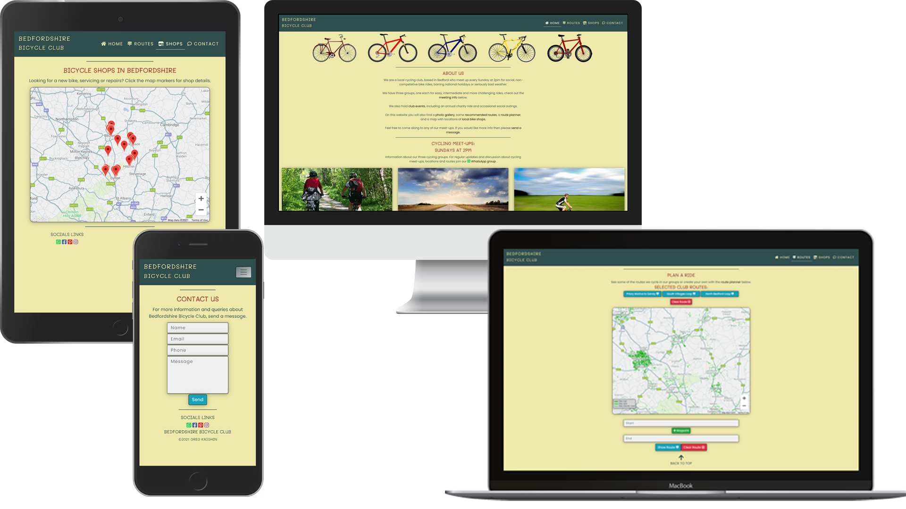
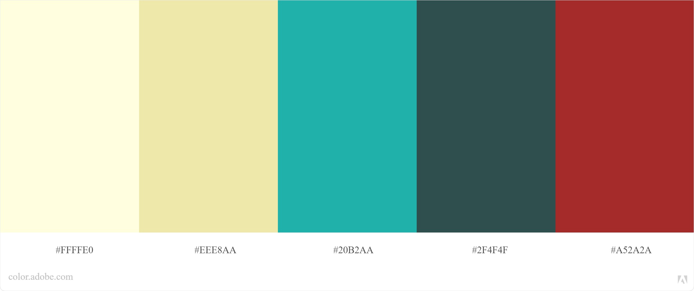
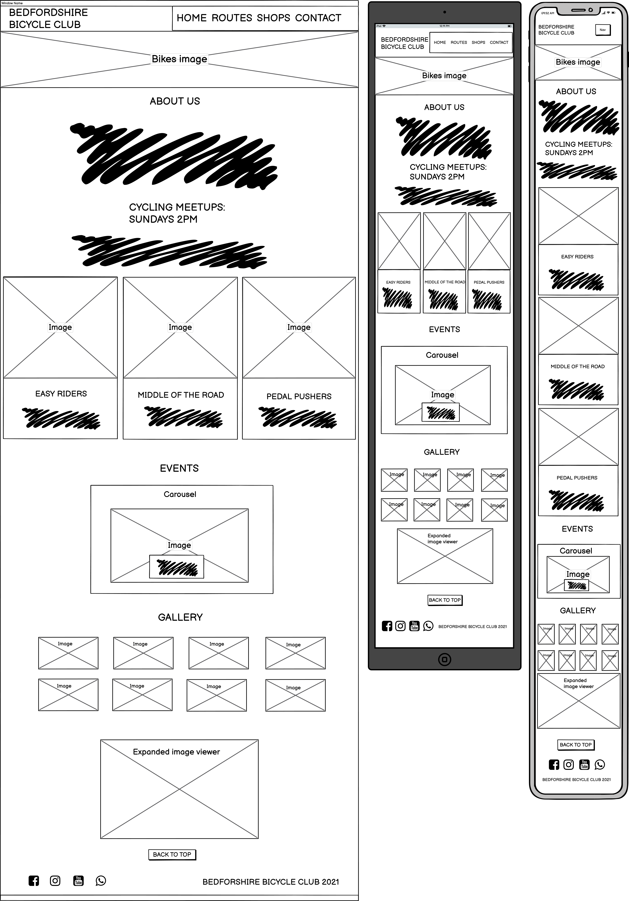
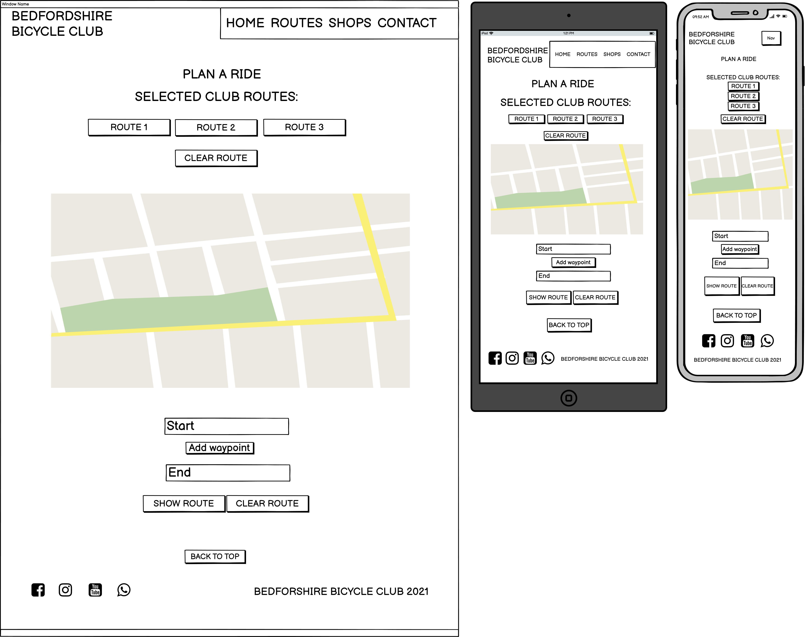
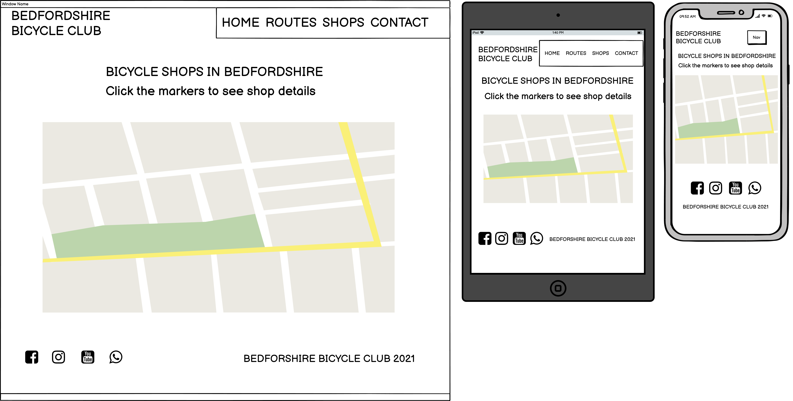
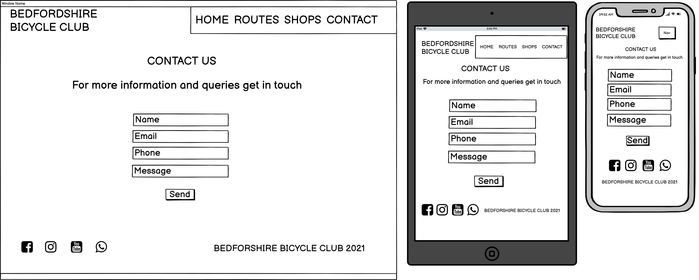

# Bedfordshire Bicycle Club

## Code Institute - Milestone Project 2

[Click here to view the website](https://gregkaighin.github.io/bedfordshire-bicycle-club/)

This website is for a ficticious local bicycle club.
The primary goal is to provide information about the club to members and people interested in joining.  

Features include a carousel with information about upcoming club events, and a photo gallery, using Bootstrap components.  

The website makes use of Google Maps API and JavaScript to provide users with a route planner which displays cycling routes used by the club, and also allows users to create their own. It also features a shop locator with map markers at locations of bicycle shops in Bedfordshire. Information about each shop is shown when the user clicks the markers.  

There is also a contact form to allow people to get in contact with the site administrator, this uses the EmailJS service.

## Table of Contents
1. [UX](#ux)
    -  [Visitor Goals](#visitor-goals)
    -  [Club Goals](#business-goals)
    -  [User Stories](#user-stories)
    -  [Design Choices](#design-choices)
    -  [Wireframes](#wireframes)
2. [Features](#features)
    - [Existing Features](#existing-features)
    - [Elements On Every Page](#elements-on-every-page)
    - [Elements Unique To Each Page](#elements-unique-to-each-page)
    - [Home Page](#home-page)
    - [Routes Page](#routes-page)
    - [Shops Page](#shops-page)
    - [Contact Page](#contact-page)
    - [Features For Future Releases](#features-for-future-releases)
3. [Technologies Used](#technologies-used)
    - [Languages](#languages)
    - [Libraries](#libraries)
    - [Tools](#tools)
4. [Testing](#testing)
    - [Validation](#validation)
    - [Performance](#performance)
5. [Deployment](#deployment)
6. [Credits](#credits)
    - [Images](#images)
    - [Original Content](#original-content)
    - [Acknowledgements](#acknowledgements)
8. [Contact](#contact)

The target audience is people who are members of the bicycle club, or who may be considering joining.

This website has been designed to provide users with information about Bedfordshire Bicycle Club. It is targeted at casual cyclists in Bedfordshire, who may have an interest in joining a social cycling club. 
The primary goal of the website is to attract people to join the club by presenting information about the club, including meeting times, social events and routes, and to promote public awareness of cycle lanes and bike shops in the county.
The website features a contact form so that visitors can contact the site with any potential query.

## User-Experience (UX):

  * ### User Stories
     
    * #### First Time Visitor Goals
      * As a First Time Visitor, I want to understand the purpose of the website and find out what Bedfordshire Bicycle Club has to offer.
      * As a First Time Visitor, I want to navigate throughout the website easily to find content.
      * As a First Time Visitor, I would like to be able to find out information about the club's cycling groups and social events, and how to get in contact.

    * #### Returning Visitor Goals
      * As a Returning Visitor, I would like to see some of the routes the club uses for their bike rides.
      * As a Returning Visitor, I want to contact the administrators with any general queries or questions about Bedfordshire Bicycle Club.
      * As a Returning Visitor, I would like to use the bike store locator to find out about bike shops in Bedfordshire.

    * #### Frequent User Goals
      * As a Frequent User, I would like to use the route planner to create routes for the club's bike rides.
      * As a Frequent User, I would like to view the different social media accounts to either view, look for updates or potentially interact with other people involved with the club.

## User Stories

As a visitor to Bedfordshire Bicycle Club website I expect/want/need:
1. To be able to navigate the website easily and to quickly find the information I am looking for.
2. To get information about Bedfordshire Bicycle Club.
3. To get information about upcoming club events.
4. To be able to view club cycling routes and to plan my own routes.
5. To find information about local bike shops.
6. To access the website on my phone, tablet and computer.
7. For the website to have a coherent look.
8. For everything to work.

# Design Choices

## Colours

The colour scheme used for this website was composed with [Adobe Color](https://color.adobe.com/create/color-wheel).

* Light Yellow `#FFFFE0`
* Cream `#EEE8AA`
* Light Sea Green `#20B2AA`
* Dark Slate Grey `#2F4F4F`
* Brown `#A52A2A`

### Typography

The font for the club name and page headings is *Mali*, and for the paragraph text is *Poppins*. 
The secondary font, used as fallback if there are any issues presenting the primary font, is *Roboto*.
All fonts are taken from [Google Fonts](https://fonts.google.com/specimen/Sansita+Swashed?query=sansita+s#standard-styles).

### Imagery

The logo was created and edited in [Adobe Photoshop](https://www.flaticon.com/). The logo is a vector image of a bicycle.

[Pixabay](https://pixabay.com/) was used to establish a full page image on the **Splash page** and a hero image on the **Home page** and **Contact page**. It was also used to input an image of a snowy landscape to the about section on the **Home page**.

[Pixabay](https://pixabay.com/) and [Unsplash](https://unsplash.com/) was used to input images in the **Things to do page** to help put an image to each description of a location. 
## Styling

# Wireframes

These wireframes were created to outline the basic structure of the site. The current version is fairly close to these, the main changes are to the logo text, which has been changed to spread over two lines instead of one, to fit better onto small screen sizes, and to the social links, which have been moved to be above the cards in the footer, as I thought they might not be noticed right at the bottom of the page.

* Home Page:

* Routes Page:

* Shops Page:

* Contact Page:

# Technologies Used:

## Languages
- HTML5
- CSS3
- JavaScript
## Libraries
- [Bootstrap](https://getbootstrap.com/) for the navbar, card, carousel, gallery and form components.
- [Font-Awesome](https://fontawesome.com/) for the icons.
- [Google Fonts](https://fonts.google.com/) for the 'Poppins' and 'Mali' fonts.
- [js popper](https://popper.js.org/) for the navbar menu-toggle.
## Tools
- [Adobe Photoshop](https://www.adobe.com/uk/products/photoshop.html) for editing the images.
- [Balsamiq Wireframes](https://balsamiq.com/) for creating the wireframes.
- [GitHub](https://github.com/) for storing the repository.
- [realfavicongenerator](https://realfavicongenerator.net/) for generating the favicons.
# Testing

## Validation
- HTML: [validator.w3.org](https://validator.w3.org/) - No errors or warnings to show.
- CSS: - [jigsaw.w3.org/css-validator](https://jigsaw.w3.org/css-validator/) - No Errors Found.
(http://jigsaw.w3.org/css-validator/validator$link)

    

## Performance

[web.dev/measure/](https://web.dev/measure/)

# Features

## Existing Features
### Elements On Every page
#### Header

#### Footer

### Elements Unique To Each Page
#### Home Page

#### Routes Page

#### Shops Page

#### Contact Page

## Features for Future Releases

# Known Issues and Potential Solutions

# Deployment

# Credits

## Images

## Original Content

## Acknowledgements

# Contact
Greg Kaighin
gregkaighin@hotmail.com

Store Locator:
https://developers.google.com/codelabs/maps-platform/google-maps-nearby-search-js#0

Route Planner:
Javascript Google Map Directions API & Places API Project - [2021] | Google Map Javascript Tutorial -
https://www.youtube.com/watch?v=BkGtNBrOhKU&t=1837s
https://developers.google.com/maps/documentation/javascript/examples/layer-bicycling
https://developers.google.com/maps/documentation/javascript/directions#DraggableDirections
https://stackoverflow.com/questions/51576925/how-to-calculate-total-distance-and-time-getdistancematrix
https://stackoverflow.com/questions/14853779/adding-input-elements-dynamically-to-form
https://stackoverflow.com/questions/42776319/bind-google-address-autocomplete-api-on-dynamically-create-input

Map styling:
https://snazzymaps.com/style/60/blue-gray

images - pixabay, wiki commons

Image Gallery:
https://www.w3schools.com/howto/tryit.asp?filename=tryhow_js_tab_img_gallery

