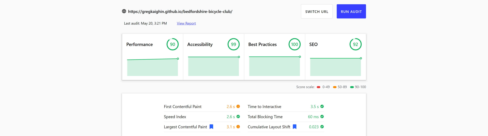

# Bedfordshire Bicycle Club

## Code Institute - Milestone Project 2

[Click here to view the website](https://gregkaighin.github.io/bedfordshire-bicycle-club/)

This website is for a ficticious local bicycle club.
The primary goal is to provide information about the club to members and people interested in joining.  

Features include a carousel showing information about upcoming club events, and a photo gallery, using Bootstrap components.  

The website makes use of Google Maps API and JavaScript to provide users with a Route Planner which displays cycling routes used by the club, and also allows users to create their own routes. It also features a shop locator with map markers at the positions of bicycle shops in Bedfordshire. Information about each shop is shown when the user clicks the markers.  

There is also a contact form to allow people to get in contact with the site administrator, this uses the EmailJS service.

## Table of Contents
1. [UX](#ux)
    -  [User Stories](#user-stories)
    -  [Design Choices](#design-choices)
    -  [Wireframes](#wireframes)
2. [Features](#features)
    - [Home Page](#home-page)
    - [Routes Page](#routes-page)
    - [Shops Page](#shops-page)
    - [Contact page](#contact-page)
    - [Features on Every Page](#features-on-every-page)
3. [Technology Used](#technology-used)
    - [Programming Languages](#programming-languages)
    - [Frameworks, Libraries and Tools](#frameworks,-libraries-and-tools)
4. [Testing](#testing)
    - [Validation](#validation)
    - [Performance](#performance)
5. [Deployment](#deployment)
6. [Credits](#credits)
    - [Acknowledgements](#acknowledgements)
8. [Contact](#contact)

The website has been designed to provide users with information about Bedfordshire Bicycle Club.  
It is targeted at club members and casual cyclists in Bedfordshire who may have an interest in joining a social cycling club.  

The primary goal of the website is to provide club members with information including meeting times, social events and routes.  

Secondary goals are to attract new members to join the club and to promote public awareness of cycle lanes and bike shops in the county.

## User-Experience (UX):

  * ### User Stories
     
    * #### First Time Visitor Goals
      * As a First Time Visitor, I want to understand the purpose of the website and find out what Bedfordshire Bicycle Club has to offer.
      * As a First Time Visitor, I want to navigate throughout the website easily to find content.
      * As a First Time Visitor, I would like to be able to find out information about the club's cycling groups and social events, and how to get in contact.

    * #### Returning Visitor Goals
      * As a Returning Visitor, I would like to see some of the routes the club uses for their bike rides.
      * As a Returning Visitor, I want to contact the administrators with any general queries or questions about Bedfordshire Bicycle Club.
      * As a Returning Visitor, I would like to use the bike store locator to find out about bike shops in Bedfordshire.

    * #### Frequent User Goals
      * As a Frequent User, I would like to use the Route Planner to create routes for the club's bike rides.
      * As a Frequent User, I would like to view the different social media accounts to either view, look for updates or potentially interact with other people involved with the club.

## User Stories

As a visitor to Bedfordshire Bicycle Club website I expect/want/need:
1. To be able to navigate the website easily and to quickly find the information I am looking for.
2. To get information about Bedfordshire Bicycle Club.
3. To get information about upcoming club events.
4. To be able to view club cycling routes and to plan my own routes.
5. To find information about local bike shops.
6. To access the website on my phone, tablet and computer.
7. For the website to have a coherent look.
8. For everything to work.

# Design Choices

## Colours

The colour scheme used for this website was composed with [Adobe Color](https://color.adobe.com/create/color-wheel).

* Light Yellow `#FFFFE0`
* Cream `#EEE8AA`
* Light Sea Green `#20B2AA`
* Dark Slate Grey `#2F4F4F`
* Brown `#A52A2A`

### Typography

The font for the club name and page headings is *Mali*, and for the paragraph text is *Poppins*. 
The secondary font, used as fallback if there are any issues presenting the primary font, is *Roboto*.
All fonts are taken from [Google Fonts](https://fonts.google.com/specimen/Sansita+Swashed?query=sansita+s#standard-styles).

### Imagery

The logo was created and edited in [Adobe Photoshop](https://www.adobe.com/uk/products/photoshop.html). It is a simple vector image of a bicycle.

[Pixabay](https://pixabay.com/) was used to source all images on the **Home page**, including the hero image, bootstrap card images and gallery images.

The hero image was created by making a collage of bicycle images in .png file format, which allows the images to retain transparency when displayed on the website. 

# Wireframes

* Home Page:

* Routes Page:

* Shops Page:

* **Contact page**:

# Features

#### Home Page

On the home page the user sees the Navbar and hero image, which immediately gives a clear idea of what the website is about.  

This is followed by a short 'about-us' section telling users information about the club, and what they can find on the website.  This section includes internal links to other parts of the website to help users quickly navigate to where they want to go.  

The next section is about cycling club meetups and gives information about the different cycling groups, and includes a link to the club's Whatsapp messaging group.

Below this is a carousel slider showing details about upcoming club events.  

The next feature is a photo gallery, which shows an expanded image when the small images are clicked.  

At the bottom of the page there is a 'back-to-top' button, social media links, and copyright information.

#### Routes Page

The routes page shows a map with clickable buttons positioned above it to show routes used by the cycling club.  

Below the map are input fields to allow the user to create their own routes including up to 8 waypoints.

Routes are displayed on the map along with a panel below, which gives a route summary and turn-by-turn directions, allowing the user to examine routes in more detail.

The markers and route are dragabble, allowing the user to modify the suggested route. The directions panel and route summary are updated when this this occurs.

The routes, input fields and waypoints can be cleared by clicking the 'clear route' buttons.

The map, routing and directions are provided by Google Maps API. The input fields give results biased towards the boundary of the map. This uses the places feature of Google Maps API.  

#### Shops Page

The shops page shows a map giving the location of up to 20 bicycle shops in Bedfordshire.

The shops are located by using the 'nearby search' feature of Google Maps API.

Information about each shop is shown to the user when they click on the marker, including the fields "rating, name, address, phone number, website". The website field is a clickable link allowing the user to navigate to shop websites.  

#### **Contact page**

The **Contact page** shows a simple form allowing users to contact the site administrator with queries. The form makes use of the EmailJS service.  

#### Features on every page

All pages have a Navbar at the top, and social links at the bottom.  

# Issues overcome

#### Issue 1

I had a problem with the Route Planner, where the Bicycle Layer (green lines) would disappear from the map on subsequent route requests.
This was because the map displays the Bicycle Layer when the map is drawn initially, and again when a route request is made using bicycle as the travel mode, causing a conflict.
This was fixed by adding "bicycleLayer: suppress" to the directions renderer object (routes.js line 144).

#### Issue 2

Also on the route plannaer, I had an issue with the waypoint input fields not returning results biased towards the boundary of the map.
This was fixed by changing the way the getBounds() is applied to the dynamically created waypoint input fields (routes.js line 173).

#### Issue 3

There was a problem with the contact form not clearing the fields after a successful form submission. This was fixed by adding `$('#form-reset')[0].reset();` to the emailjs.js file.

## Features for Future Releases

# Technology Used

## Programming Languages  

- HTML5
- CSS3
- JavaScript  

## Frameworks, Libraries and Tools 

- [Adobe Photoshop](https://www.adobe.com/uk/products/photoshop.html) for editing the images.
- [Balsamiq Wireframes](https://balsamiq.com/) for creating the wireframes.
- [Bootstrap](https://getbootstrap.com/) for the Navbar, card, carousel, gallery and form components.
- [Font-Awesome](https://fontawesome.com/) for the icons.
- [Git](https://git-scm.com/) - for version control, and for the terminal to enter the code.
- [GitHub](https://github.com/) - to store the repository pushed from Git.
- [Google Fonts](https://fonts.google.com/) for the 'Poppins' and 'Mali' fonts.
- [jQuery](https://jquery.com/) to simplify creation of some of the JavaScript funtions in the routes.js file.
- [js popper](https://popper.js.org/) for the Navbar menu toggle.
- [realfavicongenerator](https://realfavicongenerator.net/) for generating the favicons.  

# Testing

### Testing of User Stories in UX section:
     
  #### First Time Visitor Goals
    
* As a First Time Visitor, I want to understand the purpose of the website and find out what Bedfordshire Bicycle Club has to offer.

    1. On the **Home page** the user is met with the Navbar, Hero image and 'About-us' section, enabling them to quickly see what the site is about.

* As a First Time Visitor, I want to navigate throughout the website easily to find content.

    1. The Navbar and the Links in the 'About-us' section enable the user to quickly navigate to the content they want to view.

* As a First Time Visitor, I would like to be able to find out information about the club's cycling groups and social events, and how to get in contact.

    1. Information about the club cycling groups is displayed immediately below the 'About-us' section, along with a link to the club Whatsapp group. Below this is a Carousel showing information about upcoming club events. There is also a link to the **Contact page** in the Navbar.

  #### Returning Visitor Goals

* As a Returning Visitor, I would like to see some of the routes the club uses for their bike rides.

    1. On the **Routes page**, buttons to show club routes are displayed above the map, allowing the user to examine these routes easily.

* As a Returning Visitor, I want to contact the administrators with any general queries or questions about Bedfordshire Bicycle Club.

    1. Users can access the **Contact page** via the Navbar, or use the Whatsapp link displayed on the **Home page** and in Social Links in the footer on each page.

* As a Returning Visitor, I would like to use the bike store locator to find out about bike shops in Bedfordshire.

    1. The **Shops page** is accessible through the Navbar, upon loading the page, the Map shows markers at locations of bike shops. Clicking on these markers brings up details about each shop.

  #### Frequent User Goals

* As a Frequent User, I would like to use the Route Planner to create routes for the club bike rides and for myself.

    1. The user can return to the **Routes page** via the Navbar to access the Route Planner to create their own routes.

* As a Frequent User, I would like to view the different social media accounts to either view, look for updates or potentially interact with other people involved with the club.

    1. The user can access social media accounts displayed in the footer. Links take the user to a new page to view the social media accounts whilst retaining this website on the previous tab.

### Further Testing

#### The website has been tested on the following browsers:

* Firefox
* Google Chrome
* Internet Explorer
* Microsoft Edge
* Safari

#### The website has been tested on the following devices:

* Dell XPS 8940
* iPhone X
* iPhone 7
* iPad
* Lenovo Yoga Tab 3
* Moto G4
* Moto G6
* Samsung Galaxy S20

#### Testing process

The website features have been tested on devices owned by myself and family members.
The below table show the results of these tests:

##### Table Key:

&check; - *Works*, &cross; - *Doesn't Work*.

| Item tested           | Dell XPS 8940 | iPhone X | iPhone 7 | iPad 5 | Lenovo Yoga Pad Tab 3 10.1 | Moto G4 | Moto G6  |
| ----------- | ------------- | -------- | -------- | ---- | --------------- | ----------- | --------------------- |
| Navbar links                | &check;  | &check; | &check; | &check; | &check; | &check; | &check; |
| Smooth scroll behaviour     | &check;  | &cross; | &cross; | &cross; | &check; | &check; | &check; |
| Carousel                    | &check;  | &check; | &check; | &check; | &check; | &check; | &check; |
| Gallery                     | &check;  | &check; | &check; | &check; | &check; | &check; | &check; |
| Social links                | &check;  | &check; | &check; | &check; | &check; | &check; | &check; |
| Back to top button          | &check;  | &check; | &cross; | &check; | &check; | &check; | &check; |
| Hover behaviour             | &check;  | &check; | &check; | &check; | &check; | &check; | &check; |
| Map load                    | &check;  | &check; | &check; | &check; | &check; | &check; | &check; |
| Map buttons                 | &check;  | &check; | &check; | &check; | &check; | &check; | &check; |
| Info Windows and links      | &check;  | &check; | &check; | &check; | &check; | &check; | &check; |
| Show route                  | &check;  | &check; | &check; | &check; | &check; | &check; | &check; |
| Map markers                 | &check;  | &check; | &check; | &check; | &check; | &check; | &check; |
| Contact form                | &check;  | &check; | &check; | &check; | &check; | &check; | &check; |
| Contact form submit button  | &check;  | &check; | &check; | &check; | &check; | &check; | &check; |
| Contact form modal          | &check;  | &check; | &check; | &check; | &check; | &check; | &check; |

* The Navbar links and Logo work as intended.
* The `scroll-behaviour: smooth;` doesn't work on the Apple devices as shown above.
* The Carousel displayed correctly on all devices tested. On Apple devices, it displayed but without the Control buttons. It did still display each item in turn automatically.
* The Gallery worked as expected on all devices tested.
* The Social links work correctly on all devices, successfully opening up a new browser tab, and keeping the original browser tab open. Pressing the Back button returns the user without issue.
* The Back-to-Top button worked properly on each page, on all devices except the iPhone 7, where it didn't work at all.
* The Hover behaviour for the Nav Links and Back-to-Top button worked as expected on all devices tested.
* The Show Route, Clear Route and Preset Route buttons on the **Routes page** worked correctly on all devices tested.
* The Add Waypoint button on the **Routes page** works as expected on all devices, allowing the user to create a maximum of 8 input fields. An alert always appeared when attempting to create more than 8 waypoint input fields.
* The Map did not load on any device if the internet connection is very slow, even if the rest of the page loads without issue. This can usually be corrected by pressing the refresh button. 
* The Map markers, Routes, Route Summary, and Directions Panel displayed correctly on each device tested.
* The **Shops page** Info Windows opened up properly when the map markers were clicked. The links to shop websites worked as expected, opening the shop websites in a new browser tab, whilst also keeping the original tab open.
* The Contact form on the **Contact page** works as expected on all devices, including the the 'Required' popup for attempting to submit an incomplete form.
* The Contact form successfully submitted the message to EmailJS each time it was tested.
* The Contact form successfully displayed the 'Thank-you' modal after form submission. The modal can be closed by clicking the 'Ok' or 'x' buttons, and the form fields correctly reset to being blank.

### Fixed bugs

* In the HTML validation process, the Show Route, Clear Route and Preset Route buttons on the **Routes page** gave an error saying the 'button' element
 couldn't be embedded in an 'a' element. The solution was to remove the 'a' element and use `window.location.href = "#preset-routes"` instead to produce the desired scrolling.
* A media query was used to target the Map on large screens to reduce its width. This prevents the map from appearing too stretched out and encomapassing too wide a geographical area.
* A media query was used to reduce the Carousel Caption size on small screens less than 300px to allow all the information to be displayed without clipping.
* Another media query to make the Hero image smaller on very small screens, to avoid clipping off the edges of the bicycle image. This only applied on the Galaxy Fold device.
* I changed the Show Route/Clear Route button layout as they appeared inconsistent across screen sizes. Applying the Bootstrap button group class ensured they always appeared next to each other.

### Known Bugs

* The `scroll-behaviour: smooth;` doesn't work on Apple devices.
* The Carousel controls do not appear as expected on the Apple devices tested.
* The Map Legend on the **Routes page** does not render properly until after the map has fully loaded, which doesn't look nice.
* During the testing process, I noticed that the Waypoint Input Fields were not centered correctly on the Moto G6 phone. They appear to display as expected on all other devices tested. See the screenshot below:

 

## Validation
* [W3C Markup Validation](https://validator.w3.org/#validate_by_uri) was used to validate the code in each HTML file.
The four pages have been tested and they have all passed with no errors. The image shown below is of the webpage URL showing no errors.  

* [W3C CSS Validation](https://jigsaw.w3.org/css-validator/#validate_by_uri) was used to validate the CSS code in the *style.css* file.  

    

* [JShint](https://jshint.com/) was used to validate the JS in each of the JavaScript files.

## Performance

[web.dev/measure/](https://web.dev/measure/) was used to test the performance of the website. Results are shown on the screenshot below.  

## Deployment:

### GitHub Pages

This project was deployed to GitHub Pages by doing the following:

1. Sign in to GitHub and locate the GitHub Repository.
1. Select "Settings" from the menu above the Repository files.
1. Scroll down to the "GitHub Pages" section.
1. Under "Source" click the dropdown menu called "None" and select "Master Branch".
1. After selecting "Master Branch", the page will automatically refresh.
1. The website is now deployed. Return to the "GitHub Pages" section to retrieve the newly published link.

### Forking the GitHub Repository

1. Sign in to GitHub and locate the GitHub Repository.
1. Go to the top right side of the screen and below the navigation bar is the "Fork" button.
1. After clicking this, you will now have a copy of the original Repository in your GitHub account.

### Making a Local Clone

1. Sign in to GitHub and locate the Repository.
1. Above the Repository files, click on the "Code" button.
1. You are then met with three options, HTTPS, SSH and GitHub CLI. Select one and copy the URL.
1. Open Git Bash.
1. Now change the current working directory to the location you'd like the cloned directory to be made.
1. Type `Git Clone` and then paste the URL copied from step 3.
1. Press Enter. Your local clone will now be created. 

# Credits

## Acknowledgements

Thanks to [Code Institute](https://codeinstitute.net/) for providing the course and materials used to help create this website.  

Additional tutorials, help and resources used are listed below:  

### Code

* [Bootstrap 4](https://getbootstrap.com/docs/4.0/components/carousel/) was used to choose to source the code for the Carousel.
* [Code Institute](https://courses.codeinstitute.net/courses/course-v1:CodeInstitute+IFD101+2017_T3/course/) was used to help create the Contact Form on the **Contact Page**.
* [CSS Tricks](https://css-tricks.com/how-to-make-an-unobtrusive-scroll-to-top-button/) helped with amking the Back-to-Top button used on the **Home page** and **Routes page**. 
* [Google Maps Platform](https://developers.google.com/maps/documentation/javascript/examples/layer-bicycling) helped with understanding how the bicycle layer works in Google Maps API.
* [Google Maps Platform](https://developers.google.com/codelabs/maps-platform/google-maps-nearby-search-js#0) was used to help create the Shop locator on the **Shops page**.
* [Snazzy-Maps](https://snazzymaps.com/style/60/blue-gray) was used to style the Google Maps API.
* [Stack Overflow](https://stackoverflow.com/questions/14853779/adding-input-elements-dynamically-to-form) was used to learn how to dynamically create input fields for the Route planner.
* [Stack Overflow](https://stackoverflow.com/questions/42776319/bind-google-address-autocomplete-api-on-dynamically-create-input) was used to help understand how to make dynamically created input fields work to return places automatically.
* [Stack Overflow](https://stackoverflow.com/questions/4323848/how-to-handle-button-click-events-in-jquery) was used to help with targeting the Google Maps buttons.
* [W3Schools](https://www.w3schools.com/howto/tryit.asp?filename=tryhow_js_tab_img_gallery) was used to create the image Gallery.

### Images

All images used in this website were sourced from [Pixabay](https://pixabay.com/)
 
 

   

# Contact  

Greg Kaighin  

gregkaighin@hotmail.com

